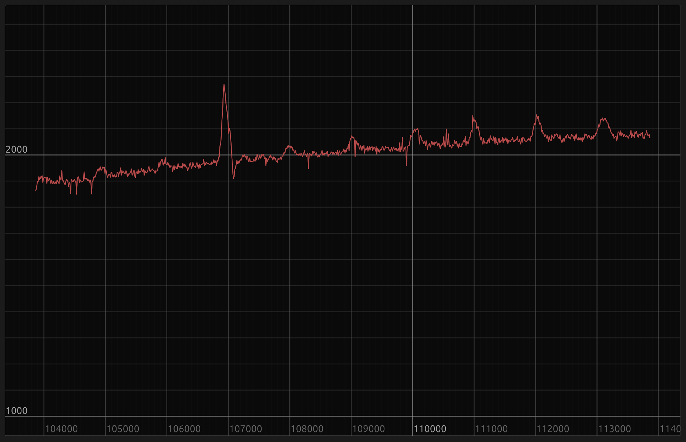

## Introduction

This project contains a Value monitoring ui
based on [egui](https://crates.io/crates/egui#quick-start).

It reads pairs of (x,y) from standard input where x is 
considered to be ever increasing and plots the received
values in real time

## Usage

Try `cargo run --help` for command line options.

It currently suports:

- setting the lookbehind window (how many x units to display until
  the graph starts scrolling
- include specific y values in the Y range (so that the the display
  does not change zoom a lot on the y axis)

